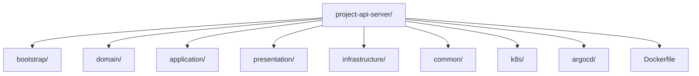
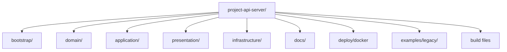

# Project-Api-Server

Health check와 resource server 역할을 담당하는 API 서버입니다. 이 저장소는 **애플리케이션 소스 코드와 로컬 개발 환경**을 중심으로 유지합니다. Kubernetes, Argo CD, 환경별 운영 선언은 `Project-Auth-GitOps`에서 관리합니다.

## 아키텍처 정리

### 변경 전 구조



### 변경 전 문제점

- 앱 소스와 운영 배포 자산이 같은 저장소에 섞여 있었습니다.
- `common` 모듈이 비어 있는데도 구조상 남아 있어 오히려 경계를 흐릴 수 있었습니다.
- GitOps repo가 이미 존재하는데도 앱 repo에 운영 선언이 중복돼 source of truth가 흔들릴 수 있었습니다.

### 변경 후 구조



### 어떤 점이 완화되었는가

- 앱 repo는 코드와 로컬 개발 자산에 집중하고, 운영 선언은 GitOps repo로 분리했습니다.
- 비어 있던 `common` 모듈을 제거해 모호한 계층을 없앴습니다.
- ArchUnit 테스트로 계층 규칙을 실제 테스트로 검증하게 했습니다.

## 현재 폴더 구조

```text
project-api-server/
├─ bootstrap/
├─ domain/
├─ application/
├─ presentation/
├─ infrastructure/
├─ docs/
│  ├─ architecture/
│  ├─ development/
│  ├─ operations/
│  └─ security/
├─ deploy/
│  ├─ docker/
│  └─ scripts/
├─ examples/
│  └─ legacy/
└─ build files
```

## 레이어 규칙

- `domain`은 Spring, JPA, Controller를 모릅니다.
- `application`은 유스케이스와 포트만 담당합니다.
- `presentation`은 HTTP 입출력만 담당합니다.
- `infrastructure`는 기술 구현체만 담당합니다.
- `bootstrap`이 전부 조립합니다.

이 규칙은 `bootstrap/src/test/java/com/project/api/architecture/LayerDependencyArchitectureTest.java`에서 ArchUnit으로 검증합니다.

## 로컬 개발 환경

이미지 빌드는 `deploy/docker/Dockerfile`을 사용합니다.

```bash
docker build -f deploy/docker/Dockerfile -t project-api-server:local .
```

로컬 실행:

```bash
docker run --rm -p 8082:8082 \
  -e APP_SERVER_PORT=8082 \
  -e APP_SECURITY_OAUTH2_RESOURCESERVER_JWT_ISSUER_URI=http://host.docker.internal:8080 \
  project-api-server:local
```

## CI 역할

이 저장소의 CI는:

- `./gradlew test`
- GHCR 이미지 빌드/푸시

까지만 담당합니다.

운영 CD는 `Project-Auth-GitOps`에서 manifest/tag 변경을 통해 Argo CD가 수행합니다.
