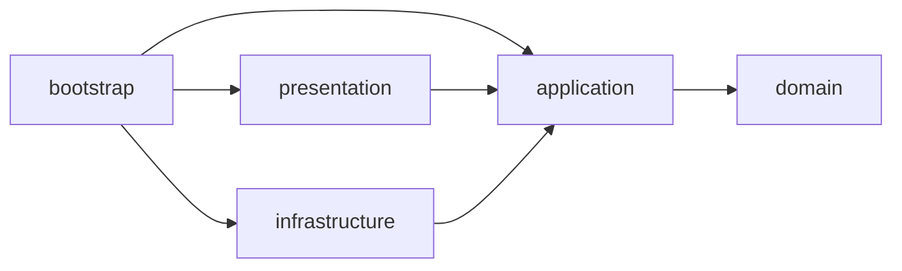

# Architecture

`Project-Api-Server`는 resource server와 health endpoint를 제공하는 비교적 얇은 애플리케이션입니다. 구조는 `auth-server`와 같은 Clean Architecture 기준을 따르되, 현재 기능 범위에 맞게 더 단순한 형태를 유지합니다.

## 한눈에 보는 의존 흐름

현재 `api-server`는 도메인과 인프라가 상대적으로 얇아서, 구조 자체는 단순하지만 의존 방향 원칙은 동일합니다.

## 레이어별 책임

### domain

도메인 규칙이 생기면 이 레이어에 둡니다.  
현재는 health/resource server 성격이 강해서 비어 있거나 매우 얇을 수 있습니다.

### application

유스케이스를 담당합니다.

- 예: `HealthStatusService`
- 역할: “현재 상태를 어떻게 읽어올 것인가” 같은 애플리케이션 흐름 정의

### presentation

HTTP 요청/응답을 담당합니다.

- `HealthCheckController`
- `PublicHealthResponse`
- `SecuredHealthResponse`

즉 REST API 표면을 이 레이어에 모읍니다.

### infrastructure

현재는 거의 비어 있지만, 앞으로 외부 저장소/외부 시스템 구현이 들어오면 이 레이어에 둡니다.

### bootstrap

Spring Boot 실행과 보안 조립을 담당합니다.

- 앱 진입점
- Security/resource server 설정
- actuator/wiring

## 현재 구조가 단순한 이유

`api-server`는 지금 역할이 비교적 명확합니다.

- OAuth2 resource server
- health endpoint
- auth-server가 발급한 JWT를 검증하는 소비자

즉 auth-server처럼 사용자 가입/로그인/OIDC/Vault/JWT signing까지 다루지 않기 때문에, 같은 레이어 구조를 유지하면서도 내부 책임 수는 적습니다.

## 왜 이 구조가 의미가 있나

지금은 얇아 보여도, 이 구조를 먼저 잡아두면 나중에 다음 같은 변화가 와도 무너지지 않습니다.

- protected API 추가
- 도메인 로직 추가
- persistence adapter 추가
- 외부 API 연동 추가

즉 “지금은 단순하지만, 커질 때도 버티는 구조”를 먼저 마련한 셈입니다.

## 테스트로 강제하는 규칙

ArchUnit 테스트로 핵심 레이어 규칙을 검증합니다.

- 위치: `bootstrap/src/test/java/com/project/api/architecture/LayerDependencyArchitectureTest.java`

현재 검증하는 규칙:

- `domain`은 Spring/JPA/Servlet을 모른다
- `application`은 `presentation`/`infrastructure`를 참조하지 않는다
- `presentation`은 `infrastructure`를 직접 참조하지 않는다
- `bootstrap`만 `config` 패키지를 조립 지점으로 사용한다

`api-server`는 현재 빈 계층이 있을 수 있으므로, ArchUnit 규칙은 그런 상태도 허용하면서 경계 위반이 생기면 바로 잡도록 구성했습니다.
